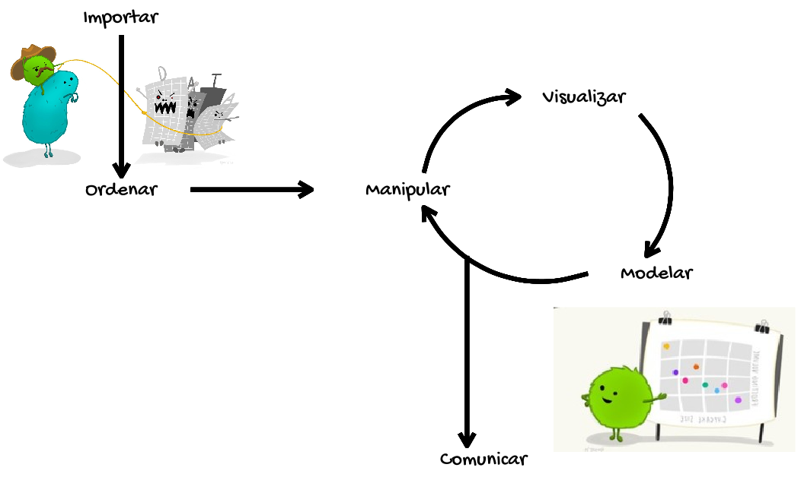

```{r, eval = TRUE, echo = FALSE, message = FALSE}

library(knitr)
```

<br>

<div class = "row">

<div class = "col-md-6">

```{r, eval = TRUE, echo = FALSE, message = FALSE, fig.align = 'center'}

include_graphics('Imagenes/imagen_curso.png')
```

</div>

<div class = "col-md-6">

__Bienvenido a R amigable - Una introducción básica a la programación usando `R`.__

Los temas a tratar en el curso, corresponden a cada uno de los pasos observados en la siguiente imagen:

```{r, eval = TRUE, echo = FALSE, message = FALSE, fig.align = 'center', out.width = '500'}


```

</div>

</div>

Se pretende que al finalizar el curso pueda:

  + Escribir código usando el lenguaje de programación `R`.

  + Adquirir distintas habilidades en la limpieza, manipulación y visualización de datos mediante el uso del lenguaje de programación `R`.

<hr>

<section style="text-align: center;">Este trabajo está bajo la licencia <a rel="license" href="http://creativecommons.org/licenses/by-nc-sa/4.0/">Creative Commons Attribution-NonCommercial-ShareAlike 4.0 International License</a>.</section>

<br>

<section style="text-align: center;"><a rel="license" href="http://creativecommons.org/licenses/by-nc-sa/4.0/"></a><br/></section>
