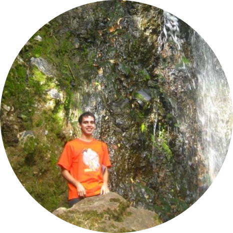

```{r, eval = TRUE, echo = FALSE, message = FALSE}

library(knitr)
```

<br>

<div class = "row">

<div class = "col-md-6">

<section style="text-align: center;"><H5> __Jorge Leonardo López Martínez__ </H5></section>

```{r, eval = TRUE, echo = FALSE, message = FALSE, fig.align = 'center', out.width = '180'}


```

<i class="fas fa-user-alt"></i></i> [leo4luffy](https://leo4luffy.github.io/)<br>
<i class="far fa-paper-plane"></i></i> jollopezma@unal.edu.co

</div>

<div class = "col-md-6">

<section style="text-align: center;"><H5> __Duvan Ariel Nieves Ruiz__ </H5></section>

```{r, eval = TRUE, echo = FALSE, message = FALSE, fig.align = 'center', out.width = '180'}


```

<i class="fas fa-user-alt"></i></i> [Duvancho321](https://github.com/Duvancho321)<br>
<i class="far fa-paper-plane"></i></i> dnieves@unal.edu.co

</div>

</div>

<hr>

<section style="text-align: center;">Este trabajo está bajo la licencia <a rel="license" href="http://creativecommons.org/licenses/by-nc-sa/4.0/">Creative Commons Attribution-NonCommercial-ShareAlike 4.0 International License</a>.</section>

<br>

<section style="text-align: center;"><a rel="license" href="http://creativecommons.org/licenses/by-nc-sa/4.0/"></a><br/></section>
