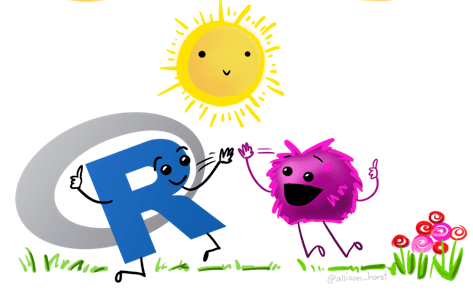

```{r, eval = TRUE, echo = FALSE, message = FALSE}

library(knitr)
```

<br>

# Clase 1: Una breve introducción al `R`

<br>

<div class = "row">

<div class = "col-md-6">

<table border="1">
<tr>
 <th></th>
 <td>Enlaces</td>
</tr>

<tr>
 <th rowspan="2">¿Que es el `R` y por qué usarlo?</th>
 <td>[presentación](https://leo4luffy.github.io/Dapositivas_R_amigable/clase_1a#1)</td>
</tr>
<tr>
 <td>video</td>
</tr>

<tr>
 <th rowspan="3">Paquetes en `R` y trabajo con proyectos</th>
 <td></td>
</tr>
<tr>
 <td></td>
</tr>
<tr>
 <td></td>
</tr>

</table>

</div>

<div class = "col-md-6">

```{r, eval = TRUE, echo = FALSE, message = FALSE, fig.align = 'center', out.width = '240'}


```

</div>

</div>
