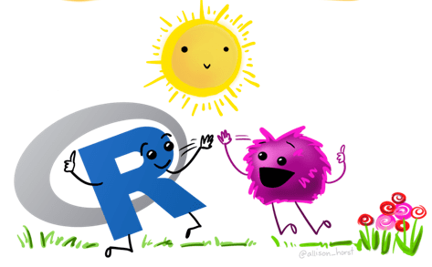

```{r, eval = TRUE, echo = FALSE, message = FALSE}

library(knitr)
```

<br>

# Clase 1: Lo básico en el uso del `R`

Al hacer clic en cada palabra como por ejemplo "presentación", podrá acceder al material del curso.

<br>

<div class = "row">

<div class = "col-md-6">

<table border="1">
<tr>
 <th></th>
 <td>Enlaces</td>
</tr>

<tr>
 <th rowspan="3">Escalares y vectores</th>
 <td>[presentación](https://leo4luffy.github.io/Dapositivas_R_amigable/clase_2a#1)</td>
</tr>
<tr>
 <td>video</td>
</tr>
<tr>
 <td>código `R`</td>
</tr>

<tr>
 <th rowspan="5">Matrices y conjuntos de datos</th>
 <td>[presentación](https://leo4luffy.github.io/Dapositivas_R_amigable/clase_2b#1)</td>
</tr>
<tr>
 <td><a href="https://github.com/Leo4Luffy/R_amigable.github.io/blob/master/conjuntos_datos/starwars.csv" download>starwars.csv</a></td>
</tr>
<tr>
 <td><a href="https://github.com/Leo4Luffy/R_amigable.github.io/blob/master/conjuntos_datos/starwars.txt" download>starwars.txt</a></td>
</tr>
<tr>
 <td>video</td>
</tr>
<tr>
 <td>código `R`</td>
</tr>

</table>

</div>

<div class = "col-md-6">

```{r, eval = TRUE, echo = FALSE, message = FALSE, fig.align = 'center', out.width = '240'}


```

</div>

</div>

<hr>

<section style="text-align: center;">Este trabajo está bajo la licencia <a rel="license" href="http://creativecommons.org/licenses/by-nc-sa/4.0/">Creative Commons Attribution-NonCommercial-ShareAlike 4.0 International License</a>.</section>

<br>

<section style="text-align: center;"><a rel="license" href="http://creativecommons.org/licenses/by-nc-sa/4.0/"></a><br/></section>