class: center, inverse

background-image: url(img/R_feliz.png)
background-position: 50% 70%
background-size: 60%

# ¿Qué es el lenguaje de programación
# `R` y por qué usarlo?

```{r setup, echo=FALSE}

library(xaringanExtra)
library(flair)
library(knitr)
```

```{r xaringan-panelset, echo=FALSE}
xaringanExtra::use_panelset()
```

```{css, echo=FALSE}
pre {
  max-width: 100%;
  overflow-x: scroll;
}

.inverse {
  background-color: #272822;
  color: #d6d6d6;
  text-shadow: 0 0 20px #333;
}
```

```{r meta, echo = FALSE, eval = FALSE}

library(metathis)

meta() %>%
  meta_general(
    description = "An overview of column-wise operations with dplyr using scoped verbs and the new across() function from dplyr 1.0.0",
    generator = "xaringan and remark.js"
  ) %>% 
  meta_name("github-repo" = "brendanhcullen/rstudio-instructor-certification") %>% 
  meta_social(
    title = "Column-wise Operations with dplyr: Old and New",
    url = "https://columnwise-operations-dplyr.netlify.app/",
    image = "https://columnwise-operations-dplyr.netlify.app/share-card.png",
    og_type = "website",
    og_author = "Brendan Cullen",
    twitter_card_type = "summary_large_image",
    twitter_creator = "@_bcullen"
  )
```

```{r xaringanExtra-share-again, echo=FALSE}
xaringanExtra::use_share_again()
```

---

```{r, eval = TRUE, echo = FALSE, message = FALSE, fig.align = 'center', out.width = '380'}

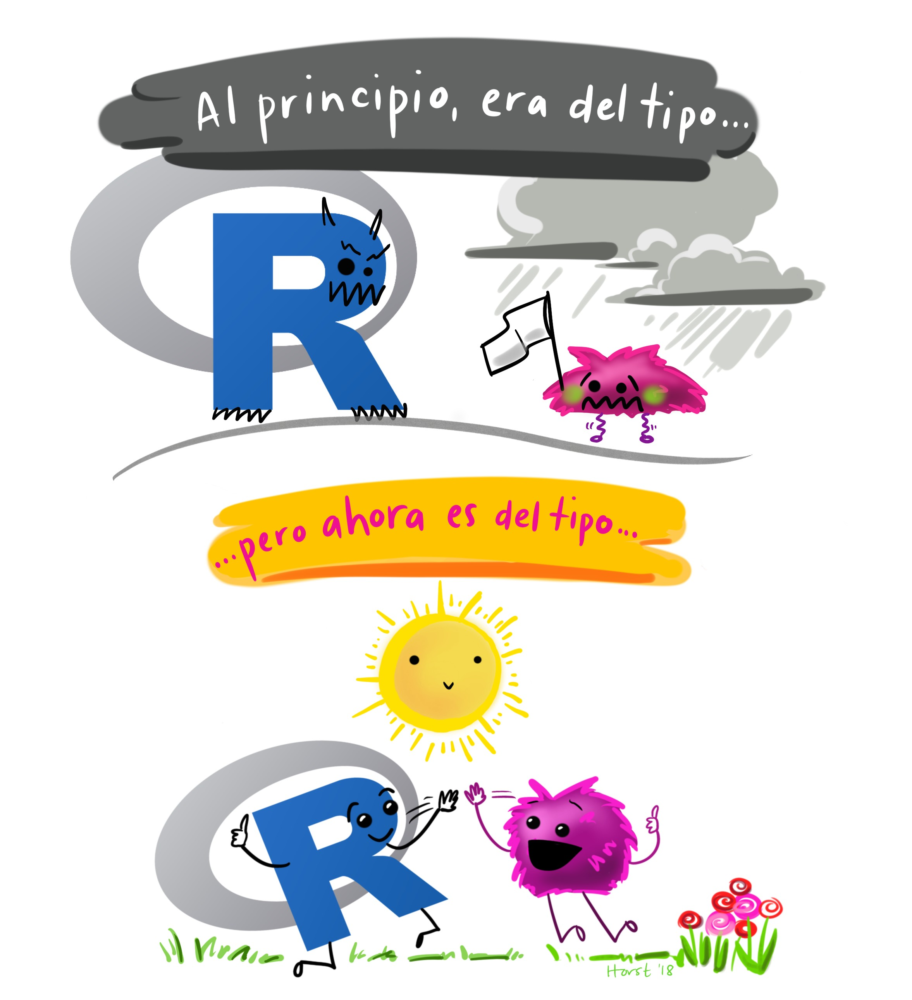
```

Los lenguajes de programación como el `R` no son sencillos de aprender, pero con trabajo y motivación verá como en poco tiempo se lograrán grandes avances.

---
class: inverse

# Objetivos de la lección

--

- ***Revisaremos*** algunas características del programa `R` que es compartida por otros lenguajes de programación.

<br>
--

- ***Hablaremos*** sobre ¿por qué usar el `R`?, donde se introducira la importancia de la comunidad del `R`.

<br>
--

- ***Aprenderemos*** sobre como se debe instalar tanto el `R` base como el RStudio.

---

# El lenguaje de programación `R`

El `R` es un programa para el análisis estadístico, creado en el año de 1902 por Robert Gentleman y Ross Ihaka. Ambos creadores de este programa le dieron el nombre de `R` al lenguaje implementado por las iniciales de sus nombres (a modo de broma).

<br>

```{r, eval = TRUE, echo = FALSE, message = FALSE, fig.align = 'center', out.width = '380'}


```

---

# El lenguaje de programación `R`

Algunas características del lenguaje de programación `R` son:

--

+ Es un Lenguaje de programación __interpretado__, debido a que se ejecuta usando
un programa intermedio llamado __intérprete__ (RStudio preferiblemente).

--

+ Es un lenguaje de programación __orientado a objetos__.

```{r, eval = TRUE, echo = FALSE, message = FALSE, fig.align = 'center', out.width = '280'}

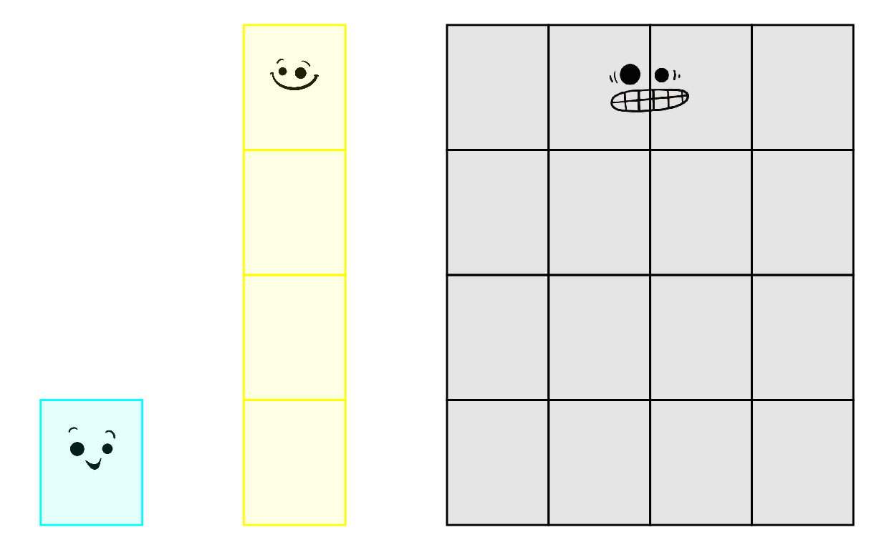
```

--

+ El intérprete del `R` está disponible en muchas plataformas (como Linux y Windows), por lo que el `R`  podrá ejecutarse en muchos computadores.

---

background-image: url(img/rladies_medellin.png)
background-position: 90% 5%
background-size: 14%

# ¿Por qué usar el programa `R`?

--

+ El lenguaje de programación `R` se puede obtener y distribuir de forma gratuita, debido a que se encuentra bajo __Licencia Pública General__. Por lo tanto es un programa de código abierto y gratis.

--

.pull-left[
+ El programa `R` cuenta con una __comunidad__ de usuarios alrededor del mundo.
]

.pull-right[
.center[
```{r echo = FALSE, out.width = "80%"}
knitr::include_graphics("img/Encuentro_R.jpg")
```
]
]

--

+ El uso del programa `R` garantiza que otro investigador pueda repetir su invetigación.

.right[
```{r echo = FALSE, out.width = "40%"}
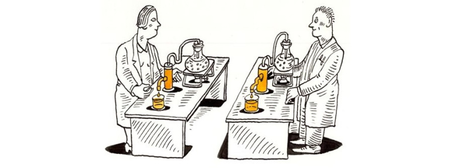
```
]

---

# Instalación de `R` base y de RStudio

+ `R` base

```{r echo = FALSE, out.width = "100%"}
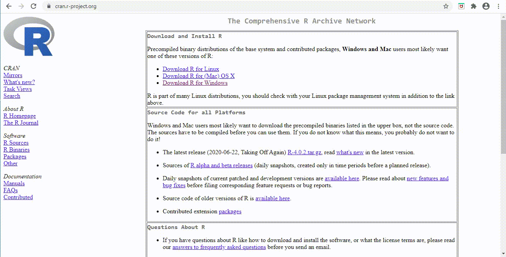
```

---

# Instalación de `R` base y de RStudio

+ `R` base

```{r echo = FALSE, out.width = "80%", fig.align = 'center'}

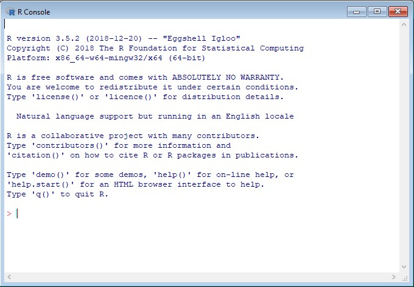
```

---

# Instalación de `R` base y de RStudio

+ RStudio

```{r echo = FALSE, out.width = "100%"}
knitr::include_graphics("img/rstudio.gif")
```

---

# Instalación de `R` base y de RStudio

+ RStudio - la fuente

```{r echo = FALSE, out.width = "100%", fig.align = 'center'}

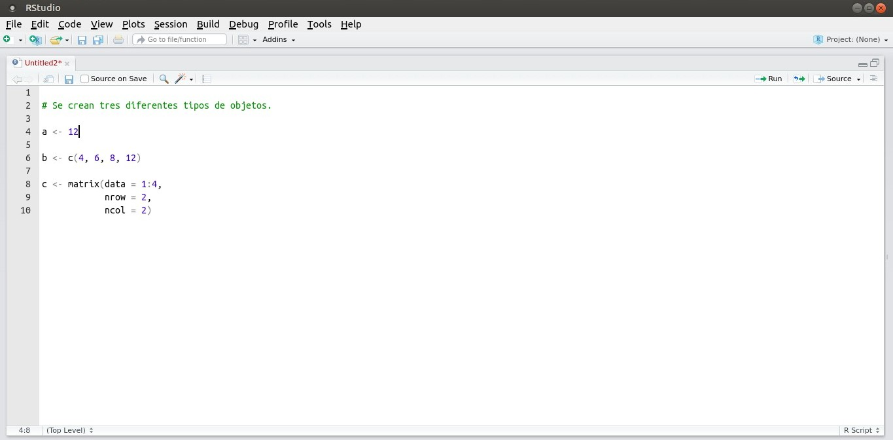
```

---

# Instalación de `R` base y de RStudio

+ RStudio - la consola

```{r echo = FALSE, out.width = "100%", fig.align = 'center'}

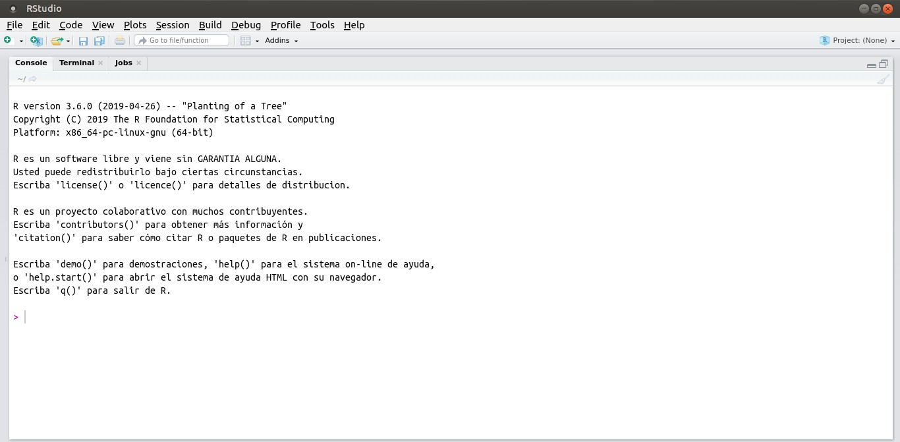
```

---

# Instalación de `R` base y de RStudio

+ RStudio - el ambiente y el historial

.pull-left[
.center[
```{r echo = FALSE, out.width = "100%", fig.align = 'center'}

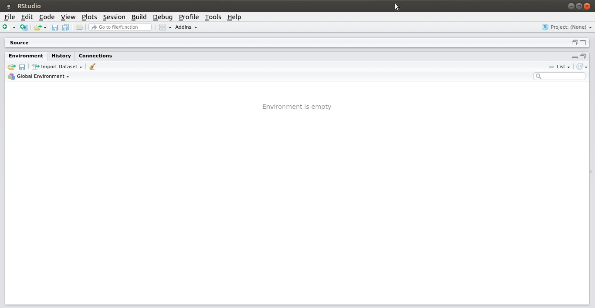
```
]
]

.pull-right[
.center[
```{r echo = FALSE, out.width = "100%", fig.align = 'center'}

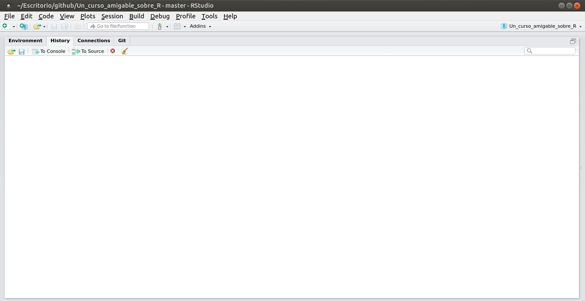
```
]
]

---

# Instalación de `R` base y de RStudio

+ RStudio - los archivos, las gráficas, la ayuda y los paquetes

.center[
.pull-left[
```{r echo = FALSE, out.width = "90%", fig.align = 'center'}

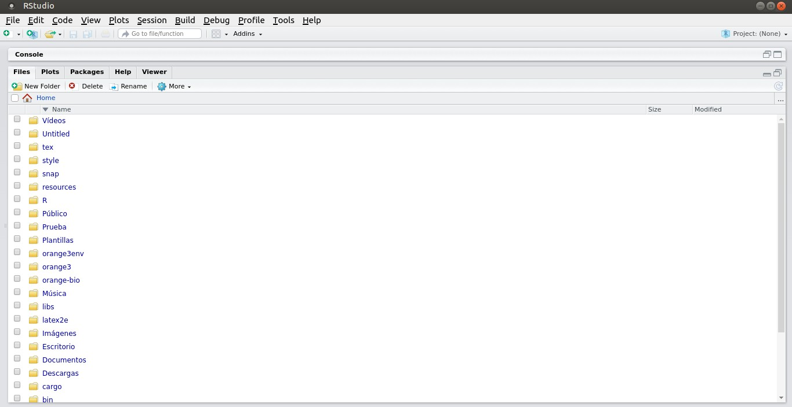
```
]

.pull-right[
```{r echo = FALSE, out.width = "90%", fig.align = 'center'}

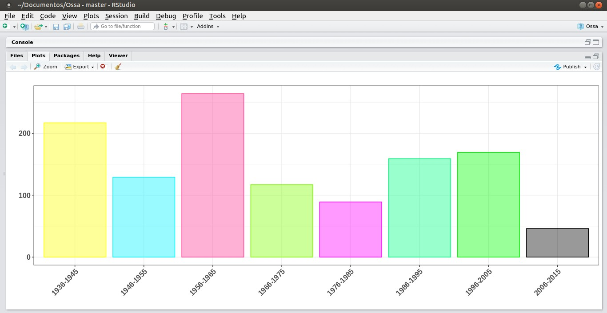
```
]
]

.center[
.pull-left[
```{r echo = FALSE, out.width = "90%", fig.align = 'center'}

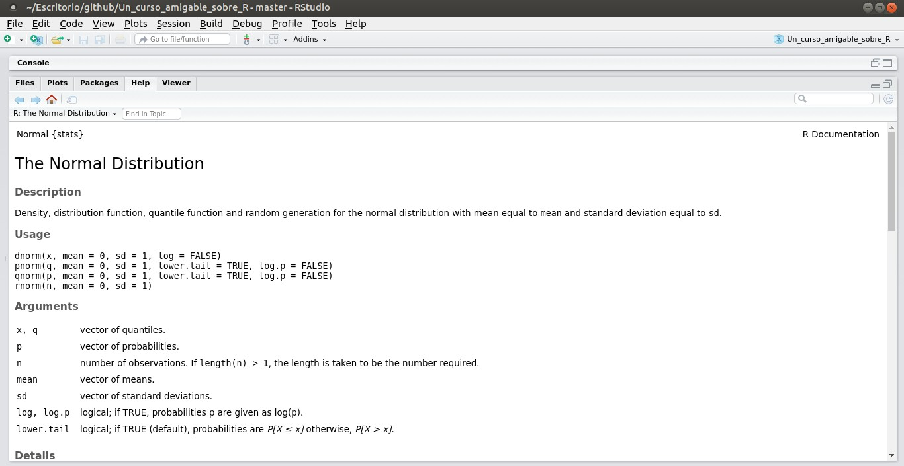
```
]

.pull-right[
```{r echo = FALSE, out.width = "90%", fig.align = 'center'}

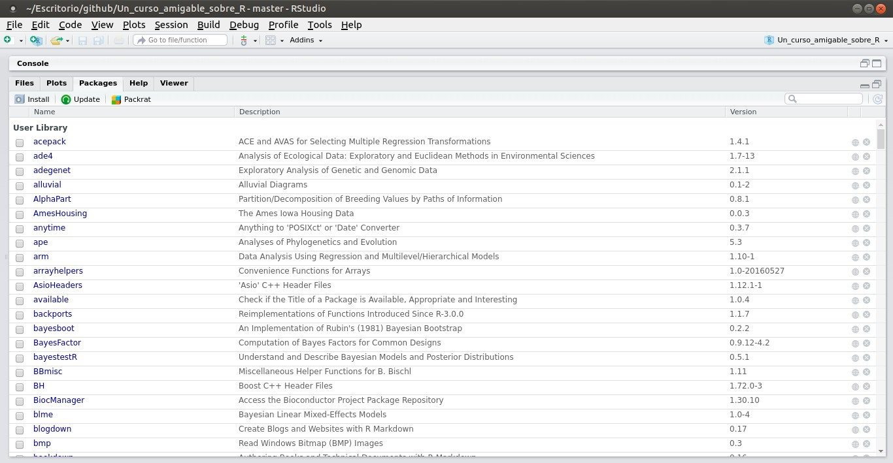
```
]
]

---

class:inverse
# Recursos de interés

- [Aquí](https://cran.r-project.org/) encontrará el enlace del CRAN para instalar el `R` base.

<br>
- [Aquí](https://rstudio.com/) encontrará el enlace de la página en donde podrá instalar RStudio.
